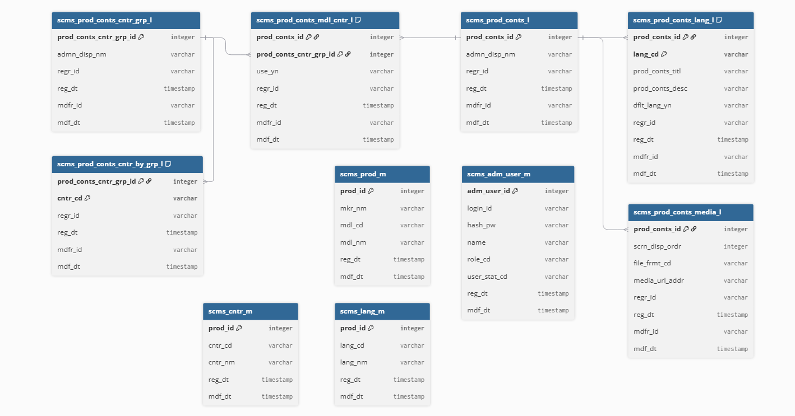

# SCMS (Smartphone Content Management System)
실제 서비스 Admin 구조를 기반으로 재구성한 프로젝트입니다.

## 1. 프로젝트 개요
- 글로벌 콘텐츠 관리 Admin CMS
- 국가 / 언어 / 제품 기준 콘텐츠 관리

## 2. 기술 스택
- Backend: Spring Boot (Java 17, MyBatis, Spring Security)
- Frontend: React (Vite)
- DB: MySQL

## 3. 주요 기능
- 로그인 (Session 기반 인증)
- 관리자 권한별 기능 접근 제어
- 콘텐츠 등록 / 수정 / 삭제 / 조회 (CRUD)
- 국가 / 언어 기준 다국어 콘텐츠 관리

## 4. 아키텍처
- Backend: Spring Boot (REST API)
- Frontend: React (Admin UI)
- DB: MySQL

## 5. 핵심 설계
- 권한 계층 구조 설계 (READ < CREATE < UPDATE < DELETE)
- 콘텐츠 - 국가 - 언어 분리 모델링 (다국어 확장 고려)
- React + Spring Boot 통합 배포 구조
- 세션 기반 인증 및 권한 검증을 API 레이어에서 일관되게 처리

## DB 스키마
- `docs/schema.sql` 파일에 전체 테이블 정의가 포함되어 있습니다.
- MySQL 8 / InnoDB / utf8mb4 기준으로 작성되었습니다.
- 프로젝트 실행 시 해당 파일을 통해 초기 DB를 구성합니다.

### ERD


## 6. 실행 방법

### 1) DB 생성

```sql
CREATE DATABASE scms DEFAULT CHARACTER SET utf8mb4;
```

---

### 2) 테이블 생성

```bash
mysql -u root -p scms < docs/schema.sql
```

> DB 스키마는 docs/schema.sql 파일을 참고

---

### 3) Backend 실행

```bash
./gradlew bootRun
```

---

### 4) Frontend 실행 (개발)

```bash
cd admin-ui
npm install
npm run dev
```

---

### 5) Frontend 빌드 (통합 실행)

```bash
cd admin-ui
npm run build
```

→ Spring Boot 실행 후  
http://localhost:8080 접속

---

### 6) 인증 방식

- Session 기반 인증 (JSESSIONID)
- React 요청 시 아래 옵션 필요

```javascript
fetch("/api/auth/me", {
  credentials: "include"
});
```
